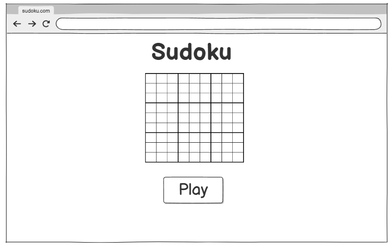
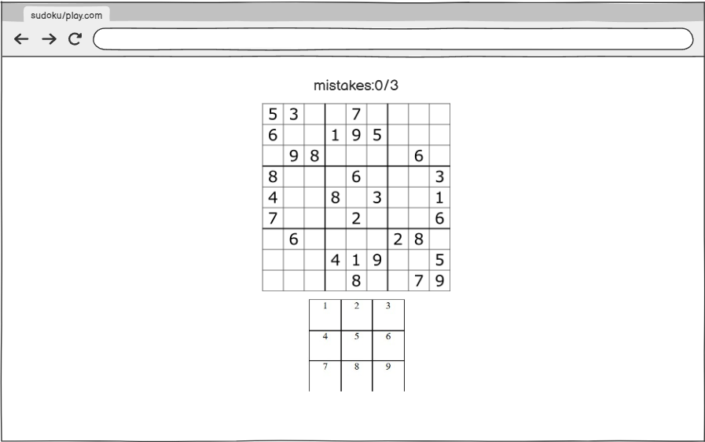

# suduko
suduko is a logic-based, number-placement puzzle the game played as follow. There is 9 boxes each box is 3*3 grid. The game started by generating number randmoly across the grids, the traget is to fill the boxes with specific numbers. But you cant repeat the same number in row,colmun and box twice


## Table of Contents

1. Technologies Used
2. Wireframe
3. Favourite Function 
4. Planning Process
5. Winner
6. Future enhancement 

## Technologies Used

- HTML
- CSS
- JavaScript

# Wireframe

[Wireframe in Balsamiq](https://balsamiq.cloud/sz034nz/pnqlxqv/r2278)





## Planning Process
- create 9 connected divs

- make every div a 3*3 grid

- make an array that the computer already had that contain the solution 

- make function isMatch that will compare the user input with the solution that the computer had

- the user have 3 mistakes if he uses all of them then the game ends


## Favourite Function

- My favourite function is isSelected because I have wrap three function in one function and it was kinda hard to figure the condition I was sruggling to find the correct logic
    
```js
const isSelcted = (event) => {
  const cell = event.target;
  if (
    isItemSelected === true &&
    selectedCell === cell &&
    cell.innerText === ""
  ) {
    unSelectElemnt(cell);
  } else if (
    isItemSelected === true &&
    !(selectedCell === cell) &&
    cell.innerText === ""
  ) {
    selectNewElement(selectedCell, cell);
  } else if (isItemSelected === false && cell.innerText === "") {
    selctElement(cell);
  }
};
// unselect element if it is alreay been selected before
const unSelectElemnt = (event) => {
  event.classList.remove("selected");
  isItemSelected = false;
  selectedCell = null;
};
// select element if nothing been selected
const selctElement = (event) => {
  event.classList.add("selected");
  isItemSelected = true;
  selectedCell = event;
};
// when element already selected but the user select new one it will switch to the new one
const selectNewElement = (oldCell, newCell) => {
  selectedCell = newCell;
  oldCell.classList.remove("selected");
  newCell.classList.add("selected");
  isItemSelected = true;
};
```
        
## Winner

- the winning is determine by filling all cells in every box

## Future enhancement 

I am planing to put some icon in music and reset button, furthermore I am planning to add note button that let user input numbers but not selecting them, also I will remove the alert messages and replace it with game over page and after finishing the game. Finally I am planning to update the generate function by implement random suduku ganerator.